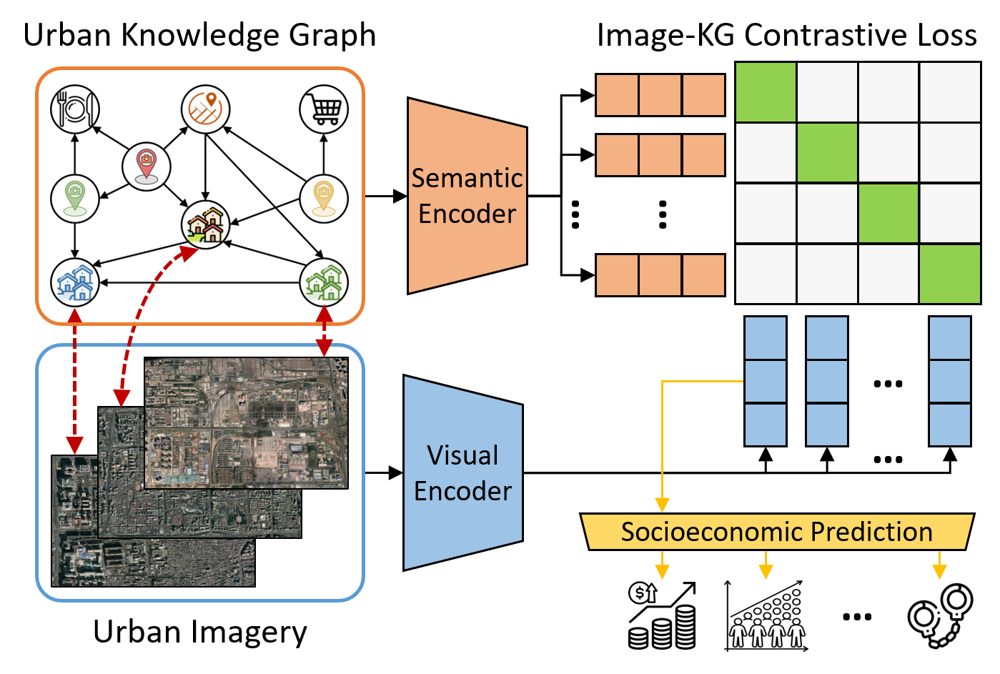

# Towards Understanding and Improving Robustness of Knowledge-Infused Contrastive Learning for Socioeconomic Prediction

This repository contains code for a project of the Urban Computing course in the 23/24 semester at Leiden University.

The project directly builds up on the KnowCL Model proposed by Liu et al. (2023). For the original paper's repository, click [here](https://github.com/tsinghua-fib-lab/UrbanKG-KnowCL/tree/main)

 
 
## Reproducing our Project

### Setting Up the Repo
Since our project uses several image datasets and pre-trained models, a few extra resources need to be downloaded from outside of GitHub.

1. Download the image datasets and place them in the data/ directory. For further details, see data/README.md .
2. Download the pre-trained ResNet18 model and place it in data/model_pretrain/. For further details, see data/model_pretrain/README.md .
3. Download the CLIP models trained via contrastive learning and place them in ours/works/. For further details, see ours/works/README.md.

### Reproducing Results
After following the above steps, you do not have to re-run the contrastive learning. However, if you do want to you can by using a command of the following format:
```
python main.py --model_name Pair_CLIP_SI --n_gcn_layer 2 --lr 0.0003 --batch_size 128 --dataset new_york --extraction_dataset new_york
```
You will be asked whether you want to perform the contrastive learning or skip it and use a trained visual encoder to only extract embeddings. If you choose to perform contrastive learning, the --extraction_dataset is set to be the same as the --dataset. If you choose to only extract embeddings, the visual encoder trained with --dataset is used to extract embeddings for the --extraction_dataset.


To train a MLP for predicting socioeconomic indicators from image embeddings, you can run a command of the following format:
```
python mlp.py --indicator pop --model_name Pair_CLIP_SI --KnowCLgcn 2 --KnowCLlr 0.0003 --KnowCLbatchsize 128 --KnowCLepoch 100 --lr 0.001  --drop_out 0.3 --wd 1.0 --cl_dataset new_york --feature_dataset new_york
```
Here, the --indicator flag defines the socioeconomic indicator to be predicted (pop, edu, or crime), the --cl_dataset flag defines what embeddings to use (what dataset was used to train the visual encoder via contrastive learning), and the --feature_dataset flag defines from what image dataset to predict the socioeconomic indicators.

## Requirements
	dgl==1.0.0
	dgl_cu102==0.6.1
	numpy==1.21.6
	pandas==1.3.5
	Pillow==9.4.0
	scikit_learn==1.2.1
	torch==1.9.0+cu111
	torchvision==0.10.0+cu111
	tqdm==4.64.1
	python==3.7.13


## Reference of the Original KnowCL Paper

    @inproceddings{liu2023knowcl,
	title 	  = {Knowledge-infused Contrastive Learning for Urban Imagery-based Socioeconomic Prediction},
	author	  = {Liu, Yu and Zhang, Xin and Ding, Jingtao and Xi, Yanxin and Li, Yong},
	booktitle = {The Web Conference},
	year      = {2023}}
